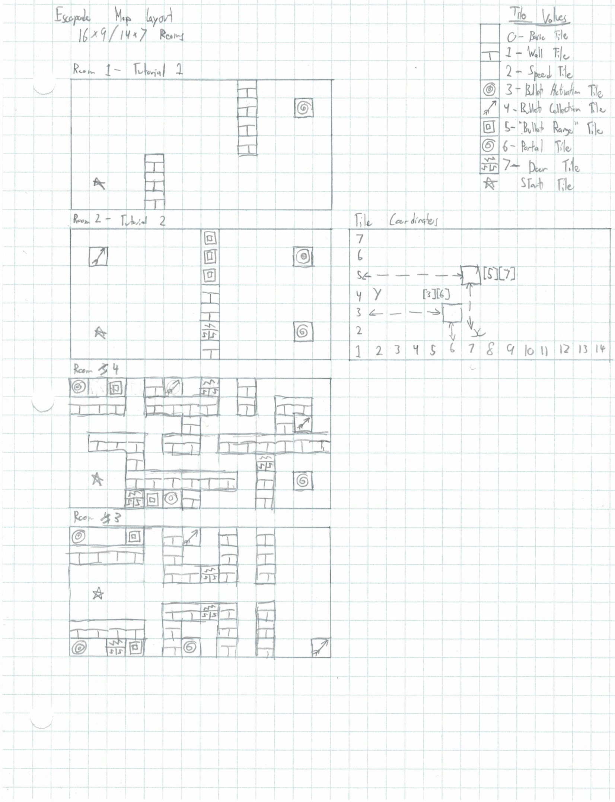

# README File - Escapade

## Objective of the Game
* The objective of the game is to solve puzzles to reach the portal at the end of the room
* Different tiles in the room correspond to different effects

## Gameplay Instructions

* WASD - Move Up/Left/Down/Right respectively

* Arrow Keys - Fire arrows in the respective directions
* Basic Tile - Player can move through normally
* Wall Tile - Player can not move through
* Speed Tile - DISCARDED
* Bullet Activation Tile - Changes something on the map when shot
* Bullet Collection Tile - Allows the player to shoot once when collected
* "Bullet Range" Tile - Player can not move through, but arrows can
* Portal Tile - Moves player to the next room
* Door Tile - Open/Closed depending

## Scoring

* The game keeps a timer to time how long the player takes to complete the game
* The timer does not count during the tutorial segments of the game

# Screen Mockup

